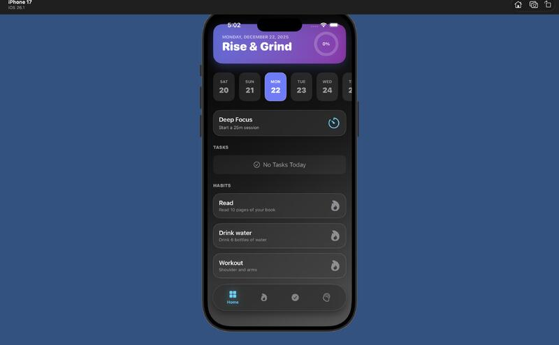
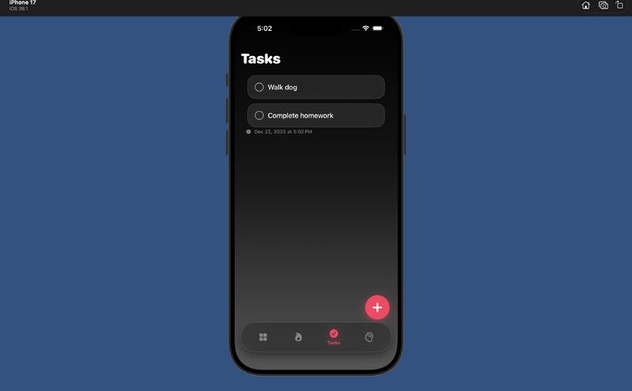
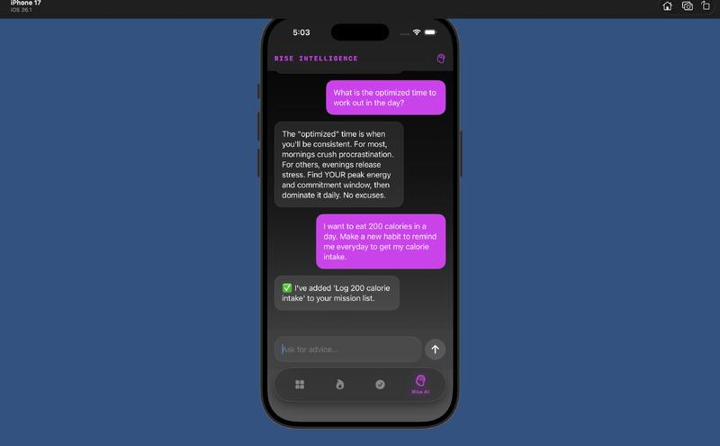

# RiseApp 🚀

### A Native iOS Productivity Ecosystem Built with SwiftUI, SwiftData & AI.

  

**RiseApp** is a local-first productivity application designed to bridge the gap between daily task management and long-term habit formation. It leverages modern iOS frameworks—including **SwiftData**, **WidgetKit**, and **ActivityKit**—to create a seamless, zero-latency experience that extends beyond the main app into the Home and Lock Screens.

---

## 📱 Interface Gallery

### Core Experience
| **Dashboard** | **Smart Tasks** | **Calendar & History** |
|:---:|:---:|:---:|
|  |  |  |
| *Personalized "Rise & Grind" Dashboard tracking daily progress.* | *Clean, gesture-driven task management with reminders.* | *History tracking and future scheduling.* |

### Intelligence & System Integration
| **AI Coach** | **Home Screen Widgets** |
|:---:|:---:|
|  |  |
| *Gemini-powered assistant for scheduling advice and motivation.* | *Interactive widgets sharing data via App Groups.* |

---

## ✨ Key Features

### 🧠 AI Productivity Coach
Integrated with the **Google Gemini API**, the AI Coach analyzes your task history and habit streaks to provide personalized motivation, breakdown complex tasks, and offer strategy tips to overcome procrastination.

### 🔥 66-Day Habit Architecture
Based on behavioral psychology, the app tracks habits over 66-day formation cycles. It uses complex many-to-many relationships in SwiftData to map habits to specific completion dates and visualizes streaks using heatmaps.

### 🍅 Deep Focus (Pomodoro)
A built-in focus timer that persists even when the app is closed.
* **Live Activities:** Real-time countdown on the Lock Screen via ActivityKit.
* **Dynamic Island:** Interactive timer controls on supported devices.

### 🎨 Gamified Experience
Productivity shouldn't be boring. RiseApp uses **CoreHaptics** and custom particle engines (Confetti Cannon) to provide tactile, high-fidelity feedback upon task completion.

---

## 🛠 Technical Highlights

This project demonstrates advanced engineering capabilities in the Apple ecosystem:

### 1. Advanced Persistence with SwiftData
* **Relational Schema:** Architected a robust `@Model` schema managing dependencies between `DailyTask`, `Habit`, and `JournalEntry` entities.
* **Complex Predicates:** Utilized advanced `#Predicate` macros to filter data by date ranges and completion status with high performance.

### 2. Multi-Process Data Sharing
* **App Groups:** Implemented a shared container architecture to synchronize data between the main app bundle, Home Screen Widgets, and Lock Screen Live Activities.
* **Zero-Latency Sync:** Ensured that marking a task "Done" in a Widget instantly updates the database without race conditions using `FileCoordinator`.

### 3. Modern Concurrency
* **Async/Await:** Replaced callback hell with structured concurrency for all network requests (Gemini API) and heavy database operations.
* **Combine:** Utilized `Combine` publishers for handling background timer events and managing reactive state streams.

---

## 🏗 Tech Stack

* **Language:** Swift 6
* **UI Framework:** SwiftUI
* **Database:** SwiftData (SQLite wrapper)
* **AI Model:** Google Gemini Pro (REST API)
* **Extensions:** WidgetKit, ActivityKit (Live Activities)
* **Feedback:** CoreHaptics, UserNotifications
* **Architecture:** MVVM (Model-View-ViewModel)

---

## 📂 Project Structure

```text
RiseApp/
├── App/
│   ├── RiseApp.swift          # App Lifecycle & Container Setup
│   └── ContentView.swift      # Root View Routing
├── Core/
│   ├── Managers/
│   │   ├── NotificationManager.swift  # Local Notification Scheduling
│   │   ├── HapticManager.swift        # CoreHaptics Engine
│   │   └── GeminiService.swift        # AI API Wrapper
│   └── Models/
│       ├── DailyTask.swift    # SwiftData Entity
│       └── Habit.swift        # SwiftData Entity
├── Views/
│   ├── Dashboard/             # Main "Rise & Grind" Dashboard
│   ├── Tasks/                 # Task Creation & Calendar Logic
│   └── AI/                    # Chat Interface
└── Extensions/
    └── RiseWidget/            # Widget Extension Target
